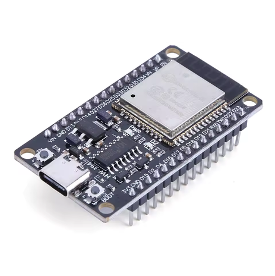

# Edge AI on ESP32: Human Activity Recognition

This project illustrates the development and implementation of a Machine Learning architecture optimized for real-time execution on embedded systems (Edge AI), specifically targeting the ESP32 microcontroller. The primary objective is the classification of physical movements starting from raw inertial data, building a mathematical pipeline that compresses spatial information to comply with the strict memory and computational constraints of the target hardware.

---

### Data Acquisition and Domain Selection
Training the models relies on processing continuous and purely numerical time series. The dataset selected to validate the architecture is the **UCI Human Activity Recognition (HAR) Using Smartphones**, publicly available for download via [Kaggle](https://www.kaggle.com/datasets/uciml/human-activity-recognition-with-smartphones) or the official UCI repository. 

This dataset represents the ideal mathematical environment for applying spatial transformations based on covariance matrices. The measurements are provided as continuous floating-point vectors derived from 50Hz readings of a spatial accelerometer and gyroscope, totaling 561 variables (features) for each discrete time instance. The samples are labeled according to six distinct physical activity classes, allowing the formulation of a supervised multiclass classification problem. To maintain clean engineering practices, the dataset is not included in the repository; instead, an automated Python script has been provided for the local download of raw data, strictly separating the source code from the storage environment.

---

### Dimensionality Reduction via Principal Component Analysis (PCA)
The high dimensionality of the original dataset (561 features) makes direct inference on a microcontroller computationally prohibitive. Therefore, the first stage of the pipeline involves a massive compression of the vector space through the implementation of Principal Component Analysis (PCA). The algorithm performs sample centering relative to the global mean vector and calculates the sample covariance matrix. Through spectral decomposition, eigenvalues and their corresponding eigenvectors are extracted, isolating the spatial directions that encapsulate the maximum energy and variance of the inertial signal. 

To preserve methodological rigor and prevent *data leakage* phenomena, the projection matrix $P$ and the mean vector $\mu$ are calculated and crystallized exclusively on the training set. Thanks to this geometric operation, the original 561-dimensional space is projected onto a dense subspace of only 20 principal components, eliminating over 96% of the background noise caused by the sensors without compromising the intrinsic structure of the movement.

---

### Discriminant Feature Extraction via LDA
Since PCA operates as an unsupervised linear transformation, its action is limited to seeking directions of maximum variability, totally ignoring the samples' affiliation with specific movement classes. Consequently, in the subspace generated by PCA, the distributions of the various physical activities are still partially or totally overlapping, complicating the placement of decision boundaries by the final classifier. 

To resolve this structural limitation, the pipeline triggers a second stage of supervised geometric transformation: Linear Discriminant Analysis (LDA). The algorithm receives the data—already purified from noise by PCA—and analyzes the spatial arrangement of the six classes. It computes the within-class scatter matrix ($S_W$), which models the internal variance of each specific movement, and the between-class scatter matrix ($S_B$), which models the distance between the centroids of the different activities. By solving the generalized eigenvalue problem associated with Fisher's Criterion, LDA identifies the optimal directions that compress samples of the same class together while simultaneously maximizing the reciprocal distance between different classes.

Respecting the theoretical limit imposed by the rank of the $S_B$ matrix, which constrains the maximum extractable dimensionality to $C-1$ (where $C$ is the number of classes), the data undergoes a final compression from 20 to 5 dimensions. This 5-element vector represents the pure and linearly separable mathematical essence of the recorded movement.

---

### Visual Analysis of the Latent Space
The effectiveness of the spatial manipulation architecture is demonstrable by analyzing the density distribution of the samples. Plotting the histogram of the data projected solely onto the First Principal Component (PC1) of the PCA reveals extensive overlap between the class distributions, proving the algorithm's blindness to the labels. 

Conversely, visualizing the histogram of the projection onto the First Discriminant Direction (LD1) extracted by the LDA drastically changes the scenario: Fisher's Criterion forces the data to cluster into tight, tall, and spatially segregated peaks. This strong visual aggregation and separation confirm the successful creation of an optimal latent space, within which a simple Multiclass Logistic Regression will be able to draw linear decision boundaries with minimal computational effort.


---

### Inference Pipeline and Latent Space Mapping

To ensure the rigorous evaluation of the models, the test set must undergo the exact same spatial transformations as the training set. It is critical to emphasize that the PCA and LDA matrices, as well as the global mean vector $\mu$, are not re-estimated on the test data; doing so would result in *data leakage* and a misaligned feature space, rendering the trained classifiers ineffective.

The mapping process is performed as a rigid linear projection:
1. **Centering:** The test dataset $X_{test}$ is centered by subtracting the mean vector $\mu$ extracted from the training set.
2. **PCA Projection:** The centered test data is projected into the 20-dimensional subspace using the projection matrix $P$ learned during the training phase.
3. **LDA Projection:** The PCA-transformed test data is further projected into the final 5-dimensional latent space using the discriminant matrix $W$ (Fisher directions) optimized on the training labels.

This workflow guarantees that every physical movement—whether captured during the training phase or encountered as a new sample in the field—is mapped into the identical geometric coordinates, allowing the generative models to process the features with consistent semantic meaning.

---

### Evaluation of Generative Classification Models

Following the projection of the dataset into the optimized five-dimensional latent space, the architecture explores generative probabilistic models to establish the classification boundaries. The primary objective at this stage is to mathematically model the underlying probability distribution of each physical activity. To achieve this, three distinct variations of Gaussian classifiers were implemented: the standard Gaussian Multivariate, the Gaussian Naive Bayes, and the Gaussian Tied Covariance. The training phase is handled by specialized algorithmic functions, namely `train_Gaussian_multivariate`, `train_Gaussian_Naive_Bayes`, and `train_Gaussian_TiedCovariance`, which extract the specific centroids and covariance matrices for the different sensory distributions.

The evaluation of the generative models on the unseen test set yielded insightful results regarding the spatial geometry of the data. The standard Gaussian Multivariate model achieved an accuracy of 85.20%. Surprisingly, the Gaussian Naive Bayes model, which naively assumes absolute statistical independence among the features by forcing a diagonal covariance matrix, slightly outperformed the former with an accuracy of 85.30%. This phenomenon mathematically validates the previous dimensionality reduction stage: the Linear Discriminant Analysis naturally projects the data onto optimized orthogonal axes, effectively decorrelating the features and rendering the Naive Bayes assumption highly accurate within the newly generated latent space.

However, the most significant milestone for the Edge AI scope of this project is represented by the Gaussian Tied Covariance model, which reached the highest accuracy of 86.90%. By mathematically constraining all six physical activity classes to share a single, global covariance matrix, the algorithm successfully mitigated the risk of overfitting associated with the highly flexible quadratic boundaries of the full multivariate approach. This structural rigidity forces the decision boundaries to become perfectly linear hyperplanes. From an embedded systems perspective, this mathematical simplification is a tremendous engineering advantage. It drastically reduces both the memory footprint, as only one covariance matrix must be stored on the ESP32 flash memory instead of six, and the computational complexity, collapsing the heavy quadratic inference equation into a highly efficient linear dot product.

| Generative Model | Decision Boundary | Accuracy on Test Set | 
 | ----- | ----- | ----- | 
| **Gaussian Multivariate** | Quadratic | 85.20% | 
| **Gaussian Naive Bayes** | Quadratic (Diagonal) | 85.30% | 
| **Gaussian Tied Covariance** | Linear | **86.90%** |

---

### Discriminative Classification: Multiclass Logistic Regression

To push the boundaries of accuracy further while maintaining absolute computational efficiency, the architecture shifts from generative modeling to a purely discriminative approach: the Multiclass Logistic Regression (Softmax Regression). Instead of modeling the statistical distributions of the classes, this algorithm focuses exclusively on optimizing the placement of linear decision boundaries (hyperplanes) to directly maximize the posterior probability $P(C|x)$.

The model parameters (the weight matrix $W$ and the bias vector $b$) are iteratively optimized to minimize a Cross-Entropy Loss function. To prevent the magnitude of the weights from growing excessively and causing overfitting, an $L_2$ regularization term is introduced, governed by the hyperparameter $\lambda$. The optimization is delegated to the L-BFGS-B numerical solver provided by the `scipy` library, utilizing analytically derived gradients for maximum convergence speed.

To determine the optimal generalization threshold, an iterative grid search was performed over logarithmic variations of the penalty parameter $\lambda$, testing the optimal weights on the previously unseen test set. Notably, during the inference phase, the computation of the actual Softmax probabilities was bypassed; the model directly evaluated the raw spatial logits ($S = W^T X_{test} + b$), extracting the predicted class via a simple `argmax` operation. This mathematical simplification yields exact results while drastically cutting down computational overhead.

```python
# Hyperparameter Tuning and Inference
lambdas = [1e-4, 1e-2, 0.1, 1.0]
best_w = 0
best_b = 0
best_acc = 0

for l in lambdas:
    # Training the Logistic Regression model using L-BFGS-B
    w, b = train_log_reg(D_train_latent, L_train, l)
    
    # Efficient inference using raw logits (bypassing exponential Softmax)
    s = w.T @ D_test_latent + b
    predictions = np.argmax(s, axis=0)
    
    accuracy = np.mean(predictions == L_test)
    if accuracy > best_acc:
        best_acc = accuracy
        best_w = w
        best_b = b
        
    print(f"Accuracy with lambda = {l} is: {accuracy * 100:.2f}%")

```

The experimental results perfectly illustrate the bias-variance tradeoff. With minimal regularization ($\lambda = 10^{-4}$), the model slightly overfits the latent space, achieving an accuracy of 86.02%. However, tuning the regularization parameter to the optimal focal point of **$\lambda = 10^{-2}$**, the Multiclass Logistic Regression reaches an outstanding peak accuracy of **87.20%**, definitively surpassing the Tied Covariance model. Excessive penalties ($\lambda = 1.0$) severely restrict the weight vectors, causing the accuracy to plummet to 84.83% due to underfitting.

| Classifier Architecture | Decision Boundary | Peak Accuracy (Test Set) |
| --- | --- | --- |
| Gaussian Multivariate | Quadratic | 85.20% |
| Gaussian Naive Bayes | Quadratic (Diagonal) | 85.30% |
| Gaussian Tied Covariance | Linear | 86.90% |
| **Multiclass Logistic Regression** | **Linear** | **87.20% ($\lambda = 0.01$)** |

The culmination of this pipeline proves that a purely discriminative, linear model represents the ultimate architecture for the target application. When deployed on the ESP32 microcontroller, the device will solely require storing a compact weight matrix ($5 \times 6$) and a small bias vector, executing classification via a fast, robust, and highly efficient linear dot product.

---

### Advanced Architectural Considerations: The Limits of Edge AI

The search for the optimal architecture for human activity recognition requires a critical analysis not only of the implemented models but also of more complex theoretical alternatives found in machine learning literature. In a traditional cloud-based or high-performance computing environment, the natural evolution of this pipeline would involve exploring algorithms capable of tracking highly non-linear decision boundaries, such as Gaussian Mixture Models (GMM) or Support Vector Machines (SVM). However, the strict constraint of real-time execution on a low-power microcontroller (Edge AI) radically shifts our evaluation criteria, rendering these complex architectures mathematically and computationally unsuitable.

The concept of modeling the probability density of each physical activity through a linear combination of multiple Gaussians (Gaussian Mixture Models) is engineering-wise incompatible with our target domain. From a spatial perspective, using multiple centroids and covariance matrices for a single class would heavily overfit the sensor noise in the training data, severely degrading the model's generalization capabilities on unseen data. More importantly, from a hardware standpoint, the computational overhead for a single inference would be catastrophic. The microcontroller would be forced to compute the inverse, determinant, and exponential of a full quadratic form for every single component Gaussian within the mixture, across all classes. This would instantly deplete the CPU's clock cycles, causing a massive drop in the sampling frequency of the inertial sensor.

A similar line of reasoning, combining strict memory limits with computational bottlenecks, rules out the deployment of Support Vector Machines. Adopting a non-linear kernel (such as the RBF kernel) to handle spatial complexity would force the system to crystallize and store a vast portion of the training dataset within the ESP32's flash memory as "support vectors." To classify a single new movement frame, the chip would have to calculate complex geometric distances between the live incoming data and hundreds or thousands of stored vectors, saturating the embedded resources immediately.

While constraining an SVM to a purely linear kernel would solve the computational bottleneck by collapsing the inference equation into a fast linear dot product ($W^T x + b$)—identical to our Logistic Regression—it introduces a fatal flaw for a practical embedded deployment: the lack of calibrated probabilities. Unlike the Softmax function, which seamlessly converts raw logits into clear, interpretable confidence percentages for each class, a pure linear SVM only outputs an algebraic distance from the decision hyperplane. This lack of probabilistic mapping makes it exceptionally difficult for the firmware to handle uncertain movements or reject false positives safely, preventing the implementation of a safety threshold (e.g., discarding any predictions where the maximum confidence is lower than 70%).

This comprehensive analysis definitively proves that Multiclass Logistic Regression represents the absolute architectural pinnacle for this embedded application. It beautifully unifies the extreme computational efficiency of a purely linear boundary with the robustness, safety, and interpretability of a well-calibrated probabilistic output.

---

### Implementation: Embedded Inference with Rust

The inference engine on the ESP32 is implemented in **Rust** using the `#[no_std]` environment, ensuring maximum performance, memory safety, and a minimal footprint without the overhead of a standard library.

#### Project Structure

* `ESP32-Rust/src/bin/main.rs`: The main entry point, containing the inference logic (linear algebra) and the hardware control loop.
* `ESP32-Rust/src/model_weights.rs`: The static parameters (weights and biases) generated automatically by the Python pipeline.
* `ESP32-Rust/src/test_data.rs`: The validation dataset used for on-chip testing and accuracy verification.

#### How to build and run

1. **Prerequisites**: A ESP32, you can buy it on AliExpress 



Ensure you have the [Rust Espressif toolchain](https://docs.espressif.com/projects/rust/book/getting-started/toolchain.html) installed on your system.

2. **Setup**: Clone the repository and enter the firmware directory:
```bash
git clone git@github.com:emmanuelmessina00/edge-biomechanics-classifier.git
cd edge-biomechanics-classifier/ESP32-Rust
```


3. **Configure Environment**: Make sure your ESP-IDF environment variables are sourced (e.g., `source $HOME/export-esp.sh`).
4. **Flash to ESP32**: Connect your ESP32 via USB and run:
```bash
cargo run 
```


#### How it works

The firmware executes a purely discriminative approach based on the `Logistic Regression` model learned in Python. Instead of computing expensive exponential Softmax probabilities, the chip calculates the raw **logits** ($S = W^T x + b$) and extracts the class via an `argmax` operation.

* **Efficiency**: The weights and test data are stored directly in the ESP32's **Flash memory**, leaving the RAM free for runtime operations.
* **Feedback**: The firmware performs real-time validation against the embedded test dataset. The onboard LED acts as a physical indicator of the classifier's performance:
  -  **LED HIGH**: Correct prediction.
  -  **LED LOW**: Incorrect prediction.


* **Latency**: Inference is completed in microseconds, well within the 50Hz sampling requirements of the original inertial sensor data.

---

