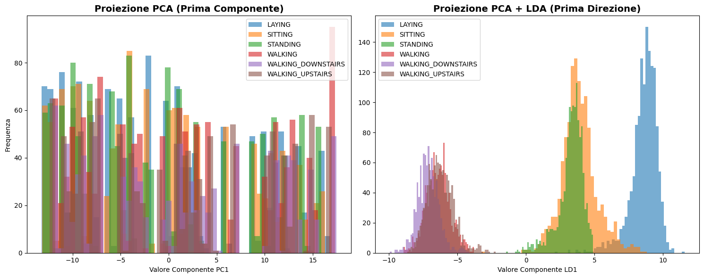

# Edge AI on ESP32: Human Activity Recognition

This project illustrates the development and implementation of a Machine Learning architecture optimized for real-time execution on embedded systems (Edge AI), specifically targeting the ESP32 microcontroller. The primary objective is the classification of physical movements starting from raw inertial data, building a mathematical pipeline that compresses spatial information to comply with the strict memory and computational constraints of the target hardware.

### Data Acquisition and Domain Selection
Training the models relies on processing continuous and purely numerical time series. The dataset selected to validate the architecture is the **UCI Human Activity Recognition (HAR) Using Smartphones**, publicly available for download via [Kaggle](https://www.kaggle.com/datasets/uciml/human-activity-recognition-with-smartphones) or the official UCI repository. 

This dataset represents the ideal mathematical environment for applying spatial transformations based on covariance matrices. The measurements are provided as continuous floating-point vectors derived from 50Hz readings of a spatial accelerometer and gyroscope, totaling 561 variables (features) for each discrete time instance. The samples are labeled according to six distinct physical activity classes, allowing the formulation of a supervised multiclass classification problem. To maintain clean engineering practices, the dataset is not included in the repository; instead, an automated Python script has been provided for the local download of raw data, strictly separating the source code from the storage environment.

### Dimensionality Reduction via Principal Component Analysis (PCA)
The high dimensionality of the original dataset (561 features) makes direct inference on a microcontroller computationally prohibitive. Therefore, the first stage of the pipeline involves a massive compression of the vector space through the implementation of Principal Component Analysis (PCA). The algorithm performs sample centering relative to the global mean vector and calculates the sample covariance matrix. Through spectral decomposition, eigenvalues and their corresponding eigenvectors are extracted, isolating the spatial directions that encapsulate the maximum energy and variance of the inertial signal. 

To preserve methodological rigor and prevent *data leakage* phenomena, the projection matrix $P$ and the mean vector $\mu$ are calculated and crystallized exclusively on the training set. Thanks to this geometric operation, the original 561-dimensional space is projected onto a dense subspace of only 20 principal components, eliminating over 96% of the background noise caused by the sensors without compromising the intrinsic structure of the movement.

### Discriminant Feature Extraction via LDA
Since PCA operates as an unsupervised linear transformation, its action is limited to seeking directions of maximum variability, totally ignoring the samples' affiliation with specific movement classes. Consequently, in the subspace generated by PCA, the distributions of the various physical activities are still partially or totally overlapping, complicating the placement of decision boundaries by the final classifier. 

To resolve this structural limitation, the pipeline triggers a second stage of supervised geometric transformation: Linear Discriminant Analysis (LDA). The algorithm receives the data—already purified from noise by PCA—and analyzes the spatial arrangement of the six classes. It computes the within-class scatter matrix ($S_W$), which models the internal variance of each specific movement, and the between-class scatter matrix ($S_B$), which models the distance between the centroids of the different activities. By solving the generalized eigenvalue problem associated with Fisher's Criterion, LDA identifies the optimal directions that compress samples of the same class together while simultaneously maximizing the reciprocal distance between different classes.

Respecting the theoretical limit imposed by the rank of the $S_B$ matrix, which constrains the maximum extractable dimensionality to $C-1$ (where $C$ is the number of classes), the data undergoes a final compression from 20 to 5 dimensions. This 5-element vector represents the pure and linearly separable mathematical essence of the recorded movement.

### Visual Analysis of the Latent Space
The effectiveness of the spatial manipulation architecture is demonstrable by analyzing the density distribution of the samples. Plotting the histogram of the data projected solely onto the First Principal Component (PC1) of the PCA reveals extensive overlap between the class distributions, proving the algorithm's blindness to the labels. 

Conversely, visualizing the histogram of the projection onto the First Discriminant Direction (LD1) extracted by the LDA drastically changes the scenario: Fisher's Criterion forces the data to cluster into tight, tall, and spatially segregated peaks. This strong visual aggregation and separation confirm the successful creation of an optimal latent space, within which a simple Multiclass Logistic Regression will be able to draw linear decision boundaries with minimal computational effort.

### Inference Pipeline and Latent Space Mapping

To ensure the rigorous evaluation of the models, the test set must undergo the exact same spatial transformations as the training set. It is critical to emphasize that the PCA and LDA matrices, as well as the global mean vector $\mu$, are not re-estimated on the test data; doing so would result in *data leakage* and a misaligned feature space, rendering the trained classifiers ineffective.

The mapping process is performed as a rigid linear projection:
1. **Centering:** The test dataset $X_{test}$ is centered by subtracting the mean vector $\mu$ extracted from the training set.
2. **PCA Projection:** The centered test data is projected into the 20-dimensional subspace using the projection matrix $P$ learned during the training phase.
3. **LDA Projection:** The PCA-transformed test data is further projected into the final 5-dimensional latent space using the discriminant matrix $W$ (Fisher directions) optimized on the training labels.

This workflow guarantees that every physical movement—whether captured during the training phase or encountered as a new sample in the field—is mapped into the identical geometric coordinates, allowing the generative models to process the features with consistent semantic meaning.

### Evaluation of Generative Classification Models

Following the projection of the dataset into the optimized five-dimensional latent space, the architecture explores generative probabilistic models to establish the classification boundaries. The primary objective at this stage is to mathematically model the underlying probability distribution of each physical activity. To achieve this, three distinct variations of Gaussian classifiers were implemented: the standard Gaussian Multivariate, the Gaussian Naive Bayes, and the Gaussian Tied Covariance. The training phase is handled by specialized algorithmic functions, namely `train_Gaussian_multivariate`, `train_Gaussian_Naive_Bayes`, and `train_Gaussian_TiedCovariance`, which extract the specific centroids and covariance matrices for the different sensory distributions.

The evaluation of the generative models on the unseen test set yielded insightful results regarding the spatial geometry of the data. The standard Gaussian Multivariate model achieved an accuracy of 85.20%. Surprisingly, the Gaussian Naive Bayes model, which naively assumes absolute statistical independence among the features by forcing a diagonal covariance matrix, slightly outperformed the former with an accuracy of 85.30%. This phenomenon mathematically validates the previous dimensionality reduction stage: the Linear Discriminant Analysis naturally projects the data onto optimized orthogonal axes, effectively decorrelating the features and rendering the Naive Bayes assumption highly accurate within the newly generated latent space.

However, the most significant milestone for the Edge AI scope of this project is represented by the Gaussian Tied Covariance model, which reached the highest accuracy of 86.90%. By mathematically constraining all six physical activity classes to share a single, global covariance matrix, the algorithm successfully mitigated the risk of overfitting associated with the highly flexible quadratic boundaries of the full multivariate approach. This structural rigidity forces the decision boundaries to become perfectly linear hyperplanes. From an embedded systems perspective, this mathematical simplification is a tremendous engineering advantage. It drastically reduces both the memory footprint, as only one covariance matrix must be stored on the ESP32 flash memory instead of six, and the computational complexity, collapsing the heavy quadratic inference equation into a highly efficient linear dot product.

| Generative Model | Decision Boundary | Accuracy on Test Set | 
 | ----- | ----- | ----- | 
| **Gaussian Multivariate** | Quadratic | 85.20% | 
| **Gaussian Naive Bayes** | Quadratic (Diagonal) | 85.30% | 
| **Gaussian Tied Covariance** | Linear | **86.90%** |